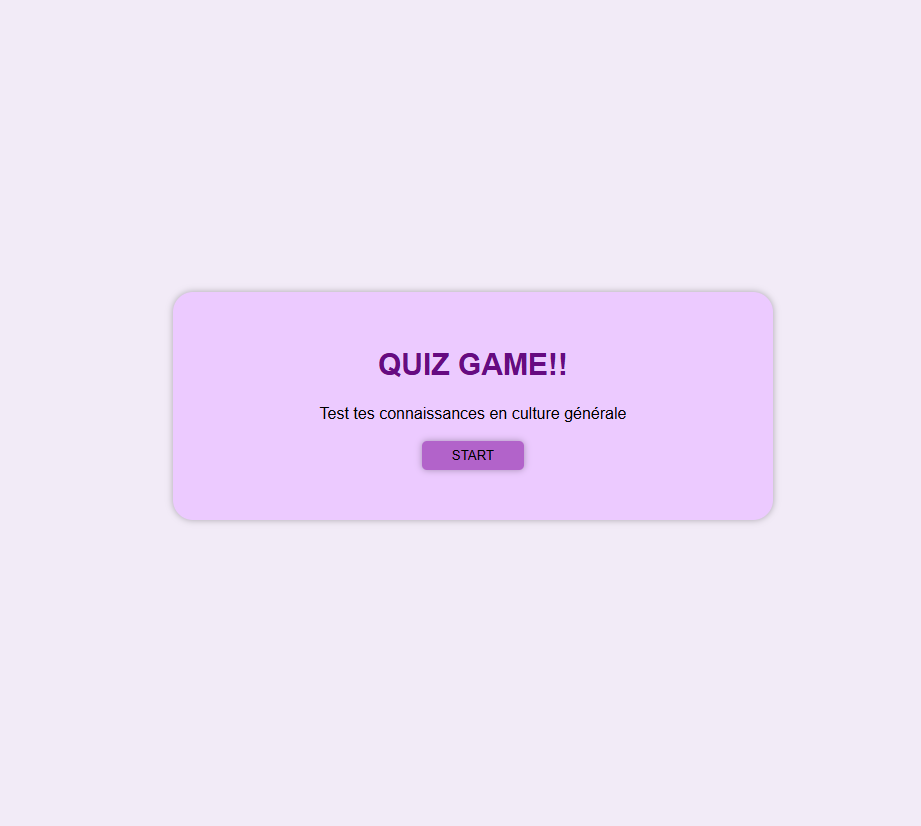

# 🎮 Quiz Game - Culture Générale

Un petit jeu interactif de quiz en **JavaScript, HTML et CSS**, permettant de tester tes connaissances en culture générale.  
Simple, amusant et accessible directement depuis le navigateur !



---

## 🚀 Fonctionnalités

- 📝 Affichage de questions à choix multiples
- ✅ Validation instantanée des réponses
- 🏆 Comptage du score en temps réel
- 🎨 Interface colorée et responsive
- 🔄 Possibilité de rejouer plusieurs fois

---

## 🛠️ Technologies utilisées

- **HTML5** → structure de la page
- **CSS3** → mise en page et design
- **JavaScript** → logique du quiz, gestion des scores et interactions

---

## 📦 Installation et utilisation

1. Clone le dépôt :
    ```bash
    git clone https://github.com/nicostar-lab/quiz-app.git
    cd quiz-game

🚀Lance le projet :
Il suffit d’ouvrir index.html dans ton navigateur.


🤝 Contribution

Les contributions sont les bienvenues !
Tu peux améliorer les questions, ajouter de nouvelles catégories ou améliorer l’interface.

📄 Licence

Projet open-source sous licence MIT.
